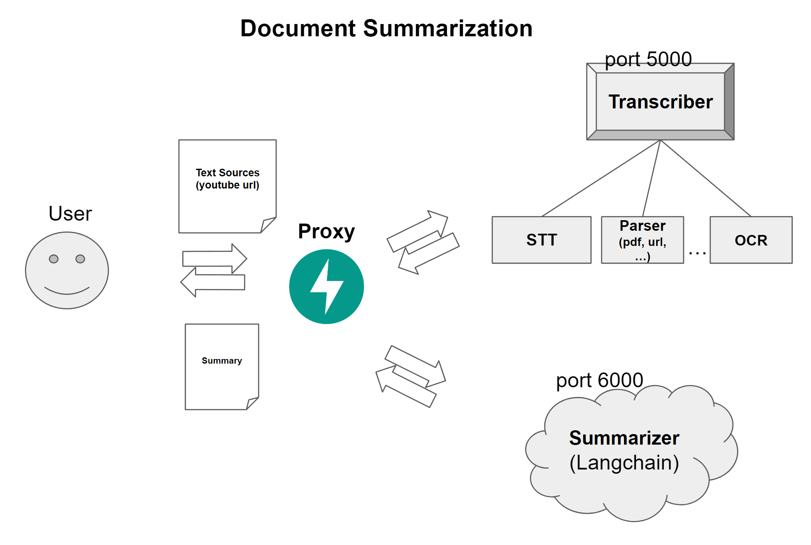

## LLM을 사용한 유튜브 영상 요약 어플리케이션

## Motivation
- [유튜브 보는 것도 지겹다! - 유튜브 영상 요약 인공지능 만들어볼까요?](https://www.youtube.com/watch?v=g77Ob5_hPKE) 본 후, 이를 API로 서빙해봐야겠다라는 생각이 들었음.

  

## Getting Started
1. .env.sample을 참고하여 .env 파일을 작성해줍니다. 바로 돌려보고싶다면, OPENAI_API_KEY만 작성해주세요.
2. ``` docker-compose up ```


### Outline



### 기술 스택
docker-compose, docker, FastAPI, MySQL, Gradio


### API endpoint
- summarize : `POST`, youtube_url


### TODO
- 인풋 아웃풋 검증 
- 비교적 간단한 구성이라 바로 올릴 수 있었지만, 만약 에러가 발생하면 어떻게 에러 - 고침 - 검증 - 피드백 과정을 빠르게 진행시킬 수 있을까? => TDD
- 성능 개선을 위한 방법 - 지금 너무 느림
    - [ ] 정확도
    - [ ] 속도

- 성능 개선 포인트
    - 동영상 -> 음성 mp3  
    - whisper 서빙 최적화  
    - langchain 서빙 최적화
        - langchain 모델 최적화
            - -> open source LLM으로 교체해서 비용을 줄일 수 있을까?
            - ??
        - langchain 자체에서
            - 텍스트 분할
            - 프롬프트 최적화
            - mapreduce 최적화

- 파이프라인 중간에 프로세스가 종료된다면? DB가 필요함
    - docker volume에 audio 파일 임시 저장