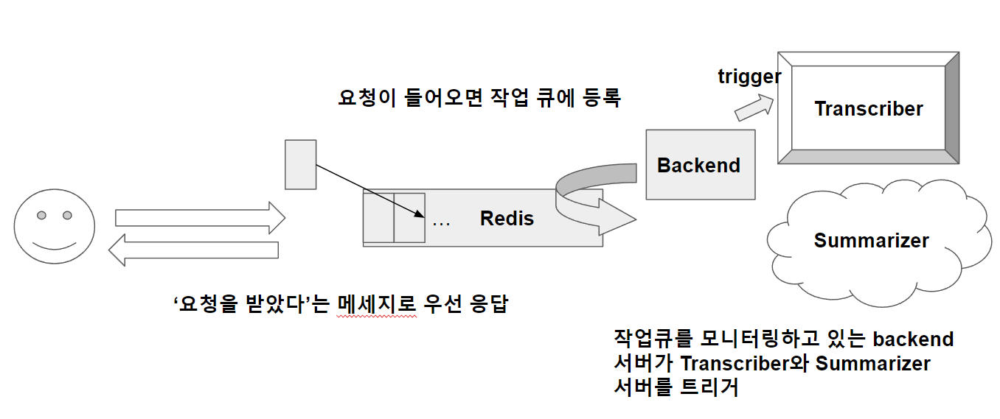

## LLM을 사용한 유튜브 영상 요약 어플리케이션

## Motivation
- [유튜브 보는 것도 지겹다! - 유튜브 영상 요약 인공지능 만들어볼까요?](https://www.youtube.com/watch?v=g77Ob5_hPKE) 본 후, 이를 API로 서빙해봐야겠다라는 생각이 들었음.

  

## Getting Started
``` docker-compose up --build ```
* .env.sample을 참고하여 .env 파일을 작성해줍니다. 바로 돌려보고싶다면, OPENAI_API_KEY만 작성해주세요.  


### Outline



### 기술 스택
docker-compose, docker, FastAPI, Redis


### API endpoint
- /list : `GET`. 
- summarize : `POST`, youtube url을 인자로 넘기면, job_id 리턴. 레디스큐에 쌓인 job은 순차적으로 작업을 처리함.
- /jobs/{job_id} : `GET`. 등록된 job을 job_id로 조회 가능. 미완료 시, youtube url을 리턴함. 완료 시, 해당 url의 summary를 리턴함.
- /jobs : `GET`. 레디스에 등록된 key, value 쌍을 전부 리턴함. 완료/미완료 작업 포함.


